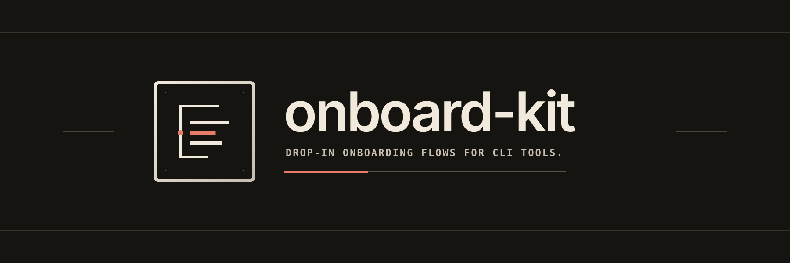

# Onboard Kit

**A simple node base onboarding flow for CLI tools.**

## Install

```sh
bun add onboard-kit @clack/prompts
```

```sh
npm install onboard-kit @clack/prompts
```

## Dependencies

- [`@clack/prompts`](https://github.com/bombshell-dev/clack)
- Node 20+ or Bun

## What it looks like

```sh
npx onboard-kit demo
```

```
┌  MyTool ──────────────────────────────
│
◇  Checking your environment
│  ✔  Node 20+
│
◇  [1/2]  Which provider?
│  OpenAI
│
◆  [2/2]  API key
│  ••••••••••••
│  ↑/↓ to navigate • Enter: confirm • Esc: back • Ctrl+C: quit
└
```

## Nodes

| Type | Nodes |
| --- | --- |
| Display | `welcome`, `note`, `done` |
| Question | `choice`, `multiChoice`, `confirm`, `text`, `secret`, `pick` |
| Work | `check`, `task`, `summary` |
